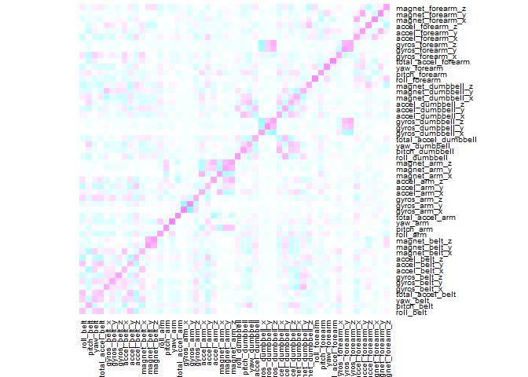

### Summary  
 In this project, my goal will be to use data from accelerometers on the belt, forearm, arm, and dumbell of 6 participants.
 In order to predict test data, I divided the original training data into 75% model training data and 25% model test data.  
 I created a random forest model and a support vector machine model and the accuracy was random forest: 0.9978, support vector machine: 0.948, so we chose the random forest model and predicted test data. 

### Background 
 Using devices such as Jawbone Up, Nike FuelBand, and Fitbit it is now possible to collect a large amount of data about personal activity relatively inexpensively. These type of devices are part of the quantified self movement - a group of enthusiasts who take measurements about themselves regularly to improve their health, to find patterns in their behavior, or because they are tech geeks. One thing that people regularly do is quantify how much of a particular activity they do, but they rarely quantify how well they do it. In this project, your goal will be to use data from accelerometers on the belt, forearm, arm, and dumbell of 6 participants. They were asked to perform barbell lifts correctly and incorrectly in 5 different ways. More information is available from the website here: http://web.archive.org/web/20161224072740/http:/groupware.les.inf.puc-rio.br/har (see the section on the Weight Lifting Exercise Dataset).

### Setup
 

```r
knitr::opts_chunk$set(echo = TRUE)
Sys.setlocale("LC_TIME","us")
```

```
## [1] "English_United States.1252"
```

```r
set.seed(1234)
```


### Version information about R
 

```r
library(lattice)
library(ggplot2)
library(caret)
library(gbm)
library(elasticnet)
library(e1071)
library(randomForest)
sessionInfo()
```

```
## R version 3.5.1 (2018-07-02)
## Platform: i386-w64-mingw32/i386 (32-bit)
## Running under: Windows 10 x64 (build 17134)
## 
## Matrix products: default
## 
## locale:
## [1] LC_COLLATE=Japanese_Japan.932      LC_CTYPE=Japanese_Japan.932       
## [3] LC_MONETARY=Japanese_Japan.932     LC_NUMERIC=C                      
## [5] LC_TIME=English_United States.1252
## 
## attached base packages:
## [1] parallel  stats     graphics  grDevices utils     datasets  methods  
## [8] base     
## 
## other attached packages:
##  [1] randomForest_4.6-14 e1071_1.7-0         elasticnet_1.1.1   
##  [4] lars_1.2            gbm_2.1.4           caret_6.0-80       
##  [7] Biobase_2.42.0      BiocGenerics_0.28.0 ggplot2_3.1.0      
## [10] lattice_0.20-38    
## 
## loaded via a namespace (and not attached):
##  [1] Rcpp_1.0.0          ddalpha_1.3.4       DRR_0.0.3          
##  [4] bindr_0.1.1         knitr_1.20          magrittr_1.5       
##  [7] cluster_2.0.7-1     splines_3.5.1       MASS_7.3-50        
## [10] magic_1.5-9         sfsmisc_1.1-2       tidyselect_0.2.5   
## [13] xtable_1.8-3        colorspace_1.3-2    gridBase_0.4-7     
## [16] R6_2.3.0            rlang_0.3.0.1       foreach_1.4.4      
## [19] bibtex_0.4.2        bigmemory_4.5.33    geometry_0.3-6     
## [22] broom_0.5.0         gower_0.1.2         withr_2.1.2        
## [25] iterators_1.0.10    htmltools_0.3.6     class_7.3-14       
## [28] recipes_0.1.3       assertthat_0.2.0    CVST_0.2-2         
## [31] abind_1.4-5         rprojroot_1.3-2     digest_0.6.18      
## [34] tibble_1.4.2        Matrix_1.2-14       rmarkdown_1.10     
## [37] compiler_3.5.1      DEoptimR_1.0-8      pillar_1.3.0       
## [40] pls_2.7-0           scales_1.0.0        backports_1.1.2    
## [43] stats4_3.5.1        lubridate_1.7.4     pkgconfig_2.0.2    
## [46] bigmemory.sri_0.1.3 munsell_0.5.0       doParallel_1.0.14  
## [49] RcppRoll_0.3.0      prodlim_2018.04.18  pkgmaker_0.27      
## [52] plyr_1.8.4          dplyr_0.7.8         stringr_1.3.1      
## [55] tools_3.5.1         rngtools_1.3.1      nnet_7.3-12        
## [58] ipred_0.9-8         grid_3.5.1          dimRed_0.2.1       
## [61] nlme_3.1-137        timeDate_3043.102   data.table_1.11.8  
## [64] gtable_0.2.0        registry_0.5        survival_2.42-3    
## [67] lazyeval_0.2.1      yaml_2.2.0          crayon_1.3.4       
## [70] bindrcpp_0.2.2      gridExtra_2.3       lava_1.6.3         
## [73] purrr_0.2.5         kernlab_0.9-27      tidyr_0.8.2        
## [76] reshape2_1.4.3      RColorBrewer_1.1-2  ModelMetrics_1.2.2 
## [79] codetools_0.2-15    rpart_4.1-13        glue_1.3.0         
## [82] evaluate_0.12       robustbase_0.93-3   NMF_0.21.0         
## [85] stringi_1.2.4
```


### Getting Data
 * The training data for this project are available [here](https://d396qusza40orc.cloudfront.net/predmachlearn/pml-training.csv)
 * The test data are available [here](https://d396qusza40orc.cloudfront.net/predmachlearn/pml-testing.csv)  
  

```r
training <- read.csv("pml-training.csv")
testing <- read.csv("pml-testing.csv")

# Dimensions
rbind(training = dim(training),testing = dim(testing))
```

```
##           [,1] [,2]
## training 19622  160
## testing     20  160
```
The data for this project come from [this source](http://web.archive.org/web/20161224072740/http:/groupware.les.inf.puc-rio.br/har). If you use the document you create for this class for any purpose please cite them as they have been very generous in allowing their data to be used for this kind of assignment.
  
### Processing Data
 First, remove The Near Zero variance variables . 

```r
#clean The Near Zero variance variables
nzv <- nearZeroVar(training)
training_nzv <- training[,-nzv]

# Dimensions
dim(training_nzv)
```

```
## [1] 19622   100
```
Next, remove the variables which almost is "NA"

```r
na_mean <- sapply(training_nzv, function(x) mean(is.na(x)))
na <- (na_mean > 0.95)

training_na <- training_nzv[,!na]
# Dimensions & names
dim(training_na);head(names(training_na),n=10)
```

```
## [1] 19622    59
```

```
##  [1] "X"                    "user_name"            "raw_timestamp_part_1"
##  [4] "raw_timestamp_part_2" "cvtd_timestamp"       "num_window"          
##  [7] "roll_belt"            "pitch_belt"           "yaw_belt"            
## [10] "total_accel_belt"
```
 For the first 5 rows we do not need.

```r
# remove the columns 
# from "X" to "cvtd_timestamp" 
processing <- training_na[-(1:5)]
dim(processing)
```

```
## [1] 19622    54
```
### the correlation heatmap 

```r
matrix_cor <- cor(processing[,-54])
heatmap(matrix_cor,Colv = NA,Rowv = NA,col = cm.colors(256))
```

<!-- -->
  
Looking at the correlation matrix, we can find combinations of variables with some correlation. However, it seems that their influence is small.

### fitting a model
Create a prediction model from the original training data.  
We know that a model that fits the original training data does not perfectly fit the test data. Therefore, it is necessary to create a model using cross validation.
First, 75% of the original training data is used as the training data of the model, and 25% is set as the test data.

```r
inTrain = createDataPartition(processing$classe, p = 0.75,list=F)
trainingdata = processing[ inTrain,]
testingdata = processing[-inTrain,]

rbind(train=dim(trainingdata), test=dim(testingdata))
```

```
##        [,1] [,2]
## train 14718   54
## test   4904   54
```


### Random Forest

```r
mod_rf <- randomForest(classe~.,data=trainingdata, method = "class")

pre_rf <- predict(mod_rf, newdata = testingdata)

confusionMatrix(pre_rf, testingdata$classe)
```

```
## Confusion Matrix and Statistics
## 
##           Reference
## Prediction    A    B    C    D    E
##          A 1395    1    0    0    0
##          B    0  948    5    0    0
##          C    0    0  850    5    0
##          D    0    0    0  799    0
##          E    0    0    0    0  901
## 
## Overall Statistics
##                                          
##                Accuracy : 0.9978         
##                  95% CI : (0.996, 0.9989)
##     No Information Rate : 0.2845         
##     P-Value [Acc > NIR] : < 2.2e-16      
##                                          
##                   Kappa : 0.9972         
##  Mcnemar's Test P-Value : NA             
## 
## Statistics by Class:
## 
##                      Class: A Class: B Class: C Class: D Class: E
## Sensitivity            1.0000   0.9989   0.9942   0.9938   1.0000
## Specificity            0.9997   0.9987   0.9988   1.0000   1.0000
## Pos Pred Value         0.9993   0.9948   0.9942   1.0000   1.0000
## Neg Pred Value         1.0000   0.9997   0.9988   0.9988   1.0000
## Prevalence             0.2845   0.1935   0.1743   0.1639   0.1837
## Detection Rate         0.2845   0.1933   0.1733   0.1629   0.1837
## Detection Prevalence   0.2847   0.1943   0.1743   0.1629   0.1837
## Balanced Accuracy      0.9999   0.9988   0.9965   0.9969   1.0000
```
As a result of testing with a random forest, the accuracy is 0.9978.


### Support Vector Machines

```r
mod_svm <- e1071::svm(classe~.,data=trainingdata)

pre_svm <- predict(mod_svm, newdata = testingdata)

confusionMatrix(pre_svm, testingdata$classe)
```

```
## Confusion Matrix and Statistics
## 
##           Reference
## Prediction    A    B    C    D    E
##          A 1381   69    3    0    0
##          B    2  862   26    0    1
##          C    9   17  814   74   16
##          D    0    0   11  729   21
##          E    3    1    1    1  863
## 
## Overall Statistics
##                                          
##                Accuracy : 0.948          
##                  95% CI : (0.9414, 0.954)
##     No Information Rate : 0.2845         
##     P-Value [Acc > NIR] : < 2.2e-16      
##                                          
##                   Kappa : 0.9341         
##  Mcnemar's Test P-Value : NA             
## 
## Statistics by Class:
## 
##                      Class: A Class: B Class: C Class: D Class: E
## Sensitivity            0.9900   0.9083   0.9520   0.9067   0.9578
## Specificity            0.9795   0.9927   0.9714   0.9922   0.9985
## Pos Pred Value         0.9504   0.9675   0.8753   0.9580   0.9931
## Neg Pred Value         0.9959   0.9783   0.9897   0.9819   0.9906
## Prevalence             0.2845   0.1935   0.1743   0.1639   0.1837
## Detection Rate         0.2816   0.1758   0.1660   0.1487   0.1760
## Detection Prevalence   0.2963   0.1817   0.1896   0.1552   0.1772
## Balanced Accuracy      0.9847   0.9505   0.9617   0.9495   0.9782
```

As a result of testing with the support vector machine, the accuracy is 0.948, which is lower than the result of the random forest.


### Prediction of test data
Predict test data using random forest that is more accurate than support vector machine.

```r
pre_rf2 <- predict(mod_rf, newdata = testing)
pre_rf2
```

```
##  1  2  3  4  5  6  7  8  9 10 11 12 13 14 15 16 17 18 19 20 
##  B  A  B  A  A  E  D  B  A  A  B  C  B  A  E  E  A  B  B  B 
## Levels: A B C D E
```
